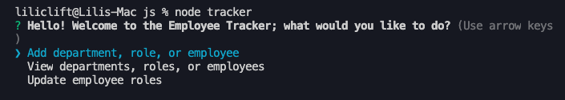

# employee-tracker

This app uses node.js and mySQL to keep track of a database containing departments, roles, and employees. Through the console, the user is able to add to the database, view data, and update certain parts of the data. 



## Instructions for Installation
* Run ```tracker.sql``` in your mySQL Workbench.
* Once the database is created, you can insert your own information (you can use the ```seed.sql``` file to see the format for adding information). Once you have the information formatted, run this in your workbench as well.
* Inside the ```js``` folder, access the ```dbConfig.js``` file and enter your mySQL password in the password field, then save.
* At this point you may need to run an ```npm install``` followed by ```npm install mysql``` and ```npm install inquirer```.
* Open an integrated terminal from the ```tracker.js``` file and run ```node tracker``` to start the program.

## Instructions for Use
* Once the program is running, follow the prompts to interact with the database!

<iframe src="https://drive.google.com/file/d/1phUlOcuMijb6MZKGit9-XYwIA4StjYye/preview" width="640" height="480"></iframe>

## Technologies Used
* JavaScript
* mySQL
* node.js
* inquirer

## Licesnse
Copyright 2020 Lili Clift Licensed under MIT License.